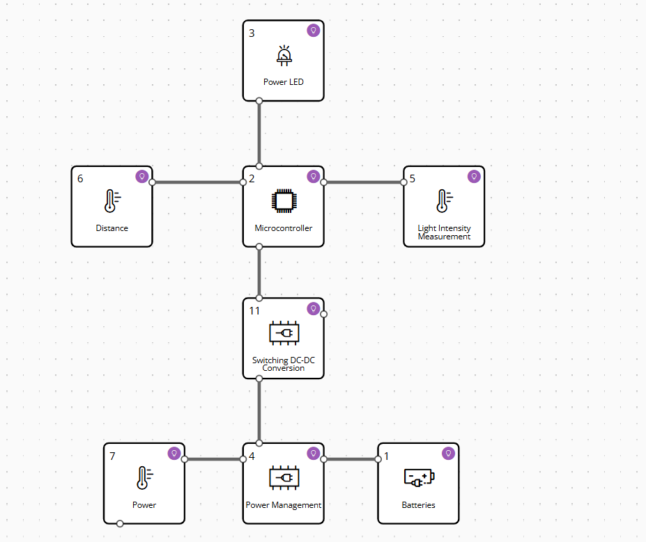

# Documentação de Hardware - Projeto de Iluminação Autônoma Solar

## Visão Geral do Projeto

Este projeto consiste em um sistema de iluminação autônoma e inteligente, projetado para operar com energia solar. Ele carrega uma bateria interna e acende uma luz ao detectar movimento, mas apenas quando a luz ambiente estiver baixa. A arquitetura de hardware é dividida em blocos funcionais para garantir eficiência e segurança.

-----

## 1\. Arquitetura do Circuito

O circuito é centrado em um chip de **Gerenciamento de Energia** (Power Management) que controla o fluxo entre as fontes de energia, a bateria e o sistema lógico.

### Diagrama de Blocos do Circuito Completo

```
+------------------------------------------------------------------------+
|                 Gerenciamento de Energia (BQ25881)                     |
|                                                                        |
|   Entrada (Vin)                    Saída (SYS)                         |
|    do Painel Solar                  para o Sistema                     |
|       ▼                                ▼                               |
|       +-----------------+--------------+-------------------------------+
|       |                 |              |                               |
|       |                 |              |                               |
|       |    Carrega/Descarrega (BAT)    |                               |
|       |                 |              |                               |
|       +-----------------+              |                               |
|       |                                |                               |
|       ▼                                ▼                               |
|   Bateria + BMS        Conversor DC-DC (5V)                            |
|                                |                                       |
|                                ▼                                       |
|                      +--------------------+                            |
|                      |   Microcontrolador |                            |
|                      |      (ESP32)       |                            |
|                      +--------------------+                            |
|                        |          |          |                         |
|          +-------------+----------+----------+-------------------------+
|          |                        |          |                         |
|          ▼                        ▼          |                         |
|      PIR Sensor                Sensor de Luz |                         |
|                                              |                         |
|                                              |                         |
|                                              ▼                         |
|                                     Transistor Driver (para o LED)     |
|                                                                        |
|                                              ▼                         |
|                                              LED                       |
|                                                                        |
+------------------------------------------------------------------------+
```



-----

## 2\. Seleção de Componentes e Justificativa

A escolha de cada componente foi pensada para garantir segurança, eficiência e funcionalidade.

* **Painel Solar (12V):** Fonte de energia primária. Sua tensão de 12V é ideal para carregar diretamente a bateria de 12V e alimentar o circuito lógico.
* **Bateria de Lítio (12V 3S):** Fornece energia para o sistema durante a noite. Uma bateria de 3 células em série (3S) tem tensão nominal de 11.1V, compatível com a fonte solar.
* **Módulo BMS (Battery Management System):** **Componente crítico para a segurança**. O BMS protege a bateria contra sobrecarga, sobredescarga e curtos-circuitos, além de realizar o balanceamento de células, prolongando a vida útil do pacote de baterias.
* **Chip de Gerenciamento de Energia (Ex: BQ25881):** O cérebro do sistema de energia. Este chip implementa a funcionalidade de ***power path***, direcionando a energia da fonte solar para a carga e, em seguida, para a bateria, de forma automática e eficiente.
* **Conversor DC-DC (Step-down):** Essencial para a eficiência. Ele recebe a tensão variável da saída do gerenciador de energia e a converte para uma tensão estável de 5V, ideal para o microcontrolador e os sensores. A alta eficiência minimiza a perda de energia em forma de calor.
* **Microcontrolador (ESP32):** O controlador lógico. O ESP32 foi escolhido por sua versatilidade, baixo consumo de energia e capacidade de processar dados dos sensores.
* **Sensor PIR (Infravermelho Passivo):** Sensor de movimento. Envia um sinal digital `HIGH` para o ESP32 quando detecta presença, ativando a rotina de acionamento da luz.
* **Sensor de Luz (LDR):** Sensor de luminosidade. Através de um divisor de tensão, ele fornece um sinal analógico ao ESP32, permitindo que o sistema determine se a luz ambiente é suficiente para ligar o LED.
* **Circuito de Controle do LED (Transistor):** A interface entre a lógica do ESP32 e a potência do LED. O transistor (ex: **2N3904**) atua como uma chave controlada pelo microcontrolador, permitindo o fluxo de corrente para o LED.

-----

## 3\. Fluxo de Operação do Circuito

O sistema opera em um ciclo contínuo, com a energia e a lógica seguindo um fluxo bem definido:

1. **Gerenciamento de Energia:** A energia do painel solar entra no chip de gerenciamento (`Vin`), que a direciona para a saída `SYS` (para alimentar o sistema) e para a porta `BAT` (para carregar a bateria via BMS).

2. **Alimentação Lógica:** O conversor DC-DC recebe a energia da saída `SYS` e a regula para 5V, alimentando o **ESP32** e os sensores de forma estável.

3. **Lógica Condicional:** O **ESP32** continuamente lê a saída dos dois sensores:

      * O sinal **digital** do **sensor PIR** (HIGH se houver movimento).
      * O sinal **analógico** do **sensor de luz**.

4. **Acionamento da Luz:** O **ESP32** só envia um sinal de ativação para o LED se **ambas** as condições forem verdadeiras:

      * `(1)` **Há movimento detectado** (sinal PIR = HIGH).
      * `(2)` **A luz ambiente é insuficiente** (o valor analógico do sensor de luz está acima de um limite programado).

5. **Controle do LED:** Se as condições forem atendidas, o **ESP32** envia um pulso à base do transistor, ativando a luz. O brilho pode ser ajustado via **PWM** (Pulse Width Modulation), permitindo um controle suave.

-----

## 4\. Lista de Materiais

* Painel Solar 12V
* Bateria de Lítio (3S, 12V)
* Módulo BMS 3S
* Chip de Gerenciamento de Bateria com ***Power Path*** (ex: BQ25881)
* Conversor DC-DC Step-down (para 5V)
* **Microcontrolador ESP32**
* Sensor de Movimento PIR (HC-SR501)
* Sensor de Luz (LDR)
* Transistor NPN (ex: 2N3904)
* LED de alta potência
* Resistores: 10kΩ, 1kΩ e 220Ω (ou 330Ω)

-----

## 5\. Esquemas e Layouts do Projeto

Esta seção é dedicada à documentação visual do projeto, fundamental para a construção e replicação.

### Diagrama Esquemático

* [Insira aqui a imagem do seu diagrama esquemático, mostrando as conexões de todos os componentes.]

### Layout da Placa de Circuito Impresso (PCB)

* [Insira aqui a imagem do layout da sua PCB, com as trilhas, componentes e silkscreen.]

### Imagens do Protótipo ou Produto Final

* [Insira aqui as fotos do seu projeto montado na protoboard ou na PCB final.]

-----

## 6\. Desenvolvedores do Projeto

**Felipe Grolla Freitas** – Engenharia de Controle e Automação (PUC-Campinas)
**Guilherme Oliveira Nogueira** – Engenharia de Controle e Automação (PUC-Campinas)
**Giovanna Lima Salvagnini** – Engenharia de Controle e Automação (PUC-Campinas)
**Henrique Spadaccia Chambó** – Engenharia de Controle e Automação (PUC-Campinas)
